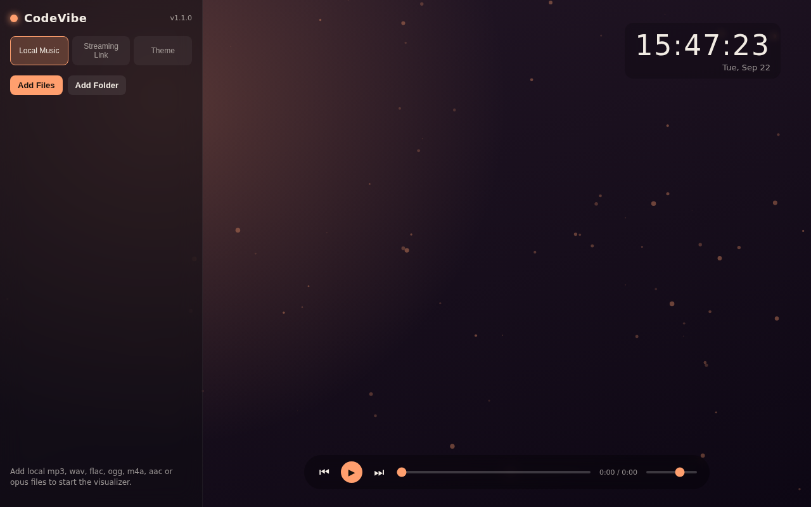
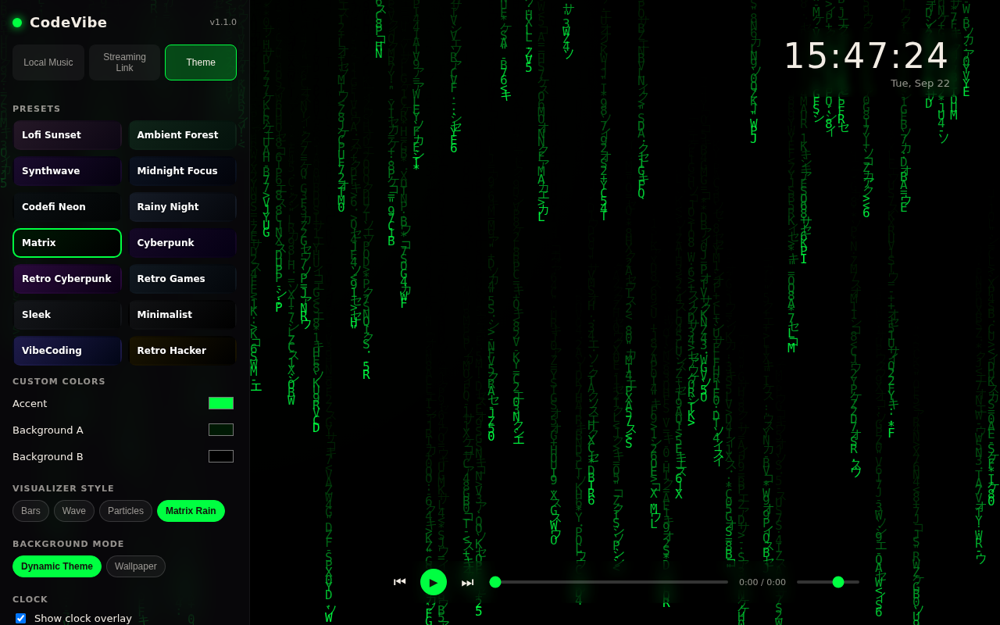
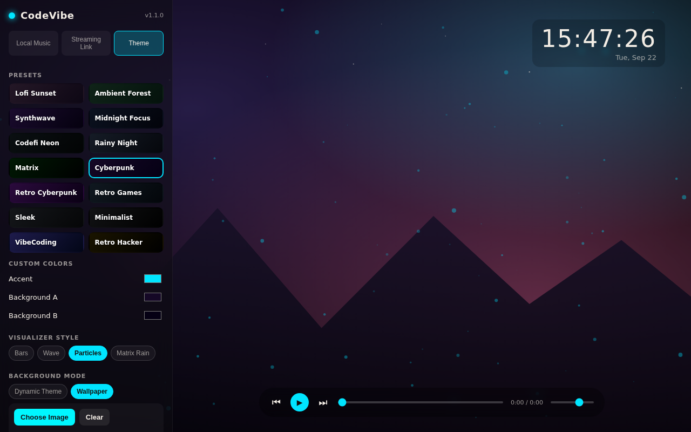

# CodeVibe

A desktop music vibe visualizer for coding, lofi, and ambiance sessions — local files or streaming links, an audio-reactive visualizer, a clock overlay, twenty-one themes, and a customizable companion avatar (with a pet!) that levels up the more you vibe, complete with a focus timer, quests, and a coin marketplace. Built with Electron; runs on Windows, macOS, and Linux.

[](https://github.com/Installation-04/codevibe/actions/workflows/release.yml)

## Screenshots

| Ambient (Lofi Sunset) | Matrix Rain | Custom wallpaper (Cyberpunk) |
| --- | --- | --- |
|  |  |  |

## Download

Grab the latest build for your OS from the [**Releases page**](https://github.com/Installation-04/codevibe/releases/latest):

| Platform | File to download | Notes |
| --- | --- | --- |
| 🪟 Windows | **`CodeVibe-Setup-<version>.exe`** | Standard installer — adds a Start Menu entry and auto-updates in place. Recommended for most people. |
| 🪟 Windows (no install) | `CodeVibe-<version>.exe` | Portable build — runs directly, no installer, nothing written outside its own folder. |
| 🍎 macOS (Apple Silicon) | **`CodeVibe-<version>-arm64.dmg`** | For M1/M2/M3/M4 Macs. Open the `.dmg` and drag CodeVibe into Applications. |
| 🍎 macOS (alternative) | `CodeVibe-<version>-arm64-mac.zip` | Same Apple Silicon build as a plain `.zip`, if you'd rather not mount a `.dmg`. |
| 🐧 Linux (most distros) | **`CodeVibe-<version>.AppImage`** | Portable — `chmod +x` it and run, no installation or package manager needed. |
| 🐧 Linux (Debian/Ubuntu) | `codevibe_<version>_amd64.deb` | Installs via `sudo apt install ./codevibe_<version>_amd64.deb` and integrates with your app menu. |

Only Apple Silicon macOS builds are published right now — Intel Mac support would need an `x64`/universal target added to the mac build. Once installed, CodeVibe checks for new releases on startup and offers an in-app update.

### macOS: "malicious software" / unverified developer warning

macOS Gatekeeper will warn about **any** app that isn't signed with a paid Apple Developer certificate and notarized by Apple — this build currently isn't, so the warning is expected and doesn't mean the app is actually malicious. To open it anyway:

1. Try double-clicking CodeVibe once (it'll refuse and show the warning) — this registers it with Gatekeeper.
2. Open **System Settings → Privacy & Security**, scroll down to the Security section, and click **Open Anyway** next to the CodeVibe message.
3. Confirm **Open** in the dialog that appears. You only need to do this once per download.

Alternatively, from Terminal, clear the quarantine flag before first launch:

```bash
xattr -cr /Applications/CodeVibe.app
```

## Features

- **Local music playback** — add individual files or a whole folder (mp3, wav, flac, ogg, m4a, aac, opus), or just drag and drop files onto the window, and play them with a real audio-reactive visualizer, driven by the Web Audio API. Drag tracks in the list to reorder them, and save the current queue as a named playlist to reload later.
- **Shuffle, repeat, and mute** — shuffle the queue, repeat all or a single track, and a one-click mute that remembers your volume. Keyboard shortcuts: Space (play/pause), M (mute), N (next), P (previous).
- **Sleep timer** — auto-stop playback after 15/30/45/60 minutes, with a live countdown.
- **7 visualizer styles** — Bars, Wave, Particles, Matrix Rain, Radial Bars, Kaleidoscope, and Orbit Rings.
- **Streaming links** — paste a YouTube (including YouTube Music and timestamped links), Spotify, or SoundCloud link and it plays in an embedded browser view alongside an ambient visualizer, with a one-click "Open in Browser Instead" fallback if a link can't be embedded (e.g. embedding disabled by the uploader). A **Gaming Lofi** shortcut row opens a YouTube search (in your default browser) for popular game-inspired lofi remixes — Skyrim, Halo, Zelda, Final Fantasy, Fallout, Elden Ring, Minecraft, Witcher — so you can find and paste in a link; nothing is bundled or embedded in-app.
- **Jellyfin and Plex** — connect to your own media server (Jellyfin: server address + username/password; Plex: sign in through plex.tv, then point it at your server) and browse and play your library directly. Server addresses are validated as http(s) URLs before use.
- **Clock overlay** — draggable, with 12h/24h format, optional seconds, 5 styles (Digital, Minimal, Boxed, Neon, Analog), 5 font families, and an adjustable size.
- **21 themes** — Lofi Sunset, Ambient Forest, Synthwave, Midnight Focus, Codefi Neon, Rainy Night, Matrix, Cyberpunk, Retro Cyberpunk, Retro Games, Sleek, Minimalist, VibeCoding, Retro Hacker, Solarized Dusk, Pastel Dreams, Frost Throne, Void Marine, Emerald Kingdom, Wasteland Radio, Pixel Quest (the last five are original game-genre-inspired looks — Nordic fantasy, sci-fi military, retro RPG, and so on) — plus a 16-color quick-pick accent palette and full custom accent/background color pickers.
- **Background modes** — **Dynamic Theme** (animated gradient/visualizer, with Gradient/Grid/Vignette/Noise background patterns), **Wallpaper** (any image of your choice, with Cover/Contain/Tile fit, adjustable dim and blur, and an option to overlay the visualizer on top), or **Scene** (six illustrated backdrops — see below).
- **Panel appearance** — adjustable blur and opacity for the glass-style sidebar and transport bar.
- **Versioning & auto-update** — the current version is shown in the sidebar, with a refresh button to check for updates on demand at any time; packaged builds also check GitHub Releases automatically on startup via `electron-updater`, and either way show an in-app banner to download and restart when a newer release is found.
- The app remembers which sidebar tab you were on, along with every other setting (theme, colors, visualizer style, clock style/font/size, background mode/pattern, wallpaper, panel appearance, playlists, shuffle/repeat/mute, streaming history), between launches.

## Your Vibe Companion — avatar, pet, focus timer, quests, and a marketplace

CodeVibe has a small, entirely local, entirely cosmetic game layer built around actually using the app — no real money involved anywhere, everything is earned by listening:

- **A customizable avatar** — body type, skin tone, hair style/color, outfit style/color, an accessory, a hat + hat color, and a held item, plus an aura effect, all mixed and matched independently rather than locked to a gender. Want a full cyberpunk look (mohawk, neon visor, piped jacket, neon glow)? Go for it. Prefer twintails, a sundress, a flower crown, and drifting petals? Just as available — pick anything, in any combination. The avatar shows up in the Avatar tab and as a small draggable widget on the stage, with an idle bob animation that also pulses gently in time with the music.
- **A companion pet** — a small creature (cat, dragon, robot, slime, owl, or fox) that rides along next to your avatar on the stage, recolorable independently.
- **Vibe Coins & levels** — listening to music (local, streaming, Jellyfin, or Plex) earns Vibe Coins and XP in real time; leveling up pays out a coin bonus.
- **A focus timer** — a Pomodoro-style timer (15/25/45/60-minute sessions, with automatic short/long breaks) on the Progress tab and as an on-stage countdown widget; completing a focus session pays out a coin/XP bonus.
- **Daily & weekly quests** — 3 daily quests (vibe for 15 minutes, finish a focus session, use shuffle) and 3 weekly quests (3 hours of vibing, 5 focus sessions, restyle your avatar 3 times), each resetting automatically and paying out coins on completion.
- **A marketplace** — the Shop tab lists every unlockable hair style, outfit, accessory, hat, held item, aura, pet, and background **Scene**, grouped by category, each with its Vibe Coin price and owned/equipped state. The same items can also be bought straight from the Avatar tab (and Scenes from the Theme tab) — buying and equipping are one click.
- **Scenes** — six illustrated background scenes (Cozy Study, Zen Garden, Beach Sunset, Enchanted Forest, Cyberpunk Skyline, Deep Space) selectable as a third background mode alongside Dynamic Theme and Wallpaper.
- **Achievements & milestones** — 24 achievements covering listening milestones, streaks, night-owl/early-bird sessions, trying every theme/visualizer, shopping, focus sessions, and pet collecting, each paying out a coin reward the moment it's earned, with a toast notification and a running list (with progress) on the Progress tab.
- **A 7-day listening history chart** and a **shareable Vibe Card** — export your avatar, level, coins, streak, vibe time, and achievement count as a PNG to share.

All of this lives in its own local save file (separate from your regular settings) and never touches the network.

## Security

- The streaming `<webview>` (YouTube/Spotify/SoundCloud embeds) runs with node integration and Chromium sandboxing forced on, regardless of what any attribute on the tag requests, and can't spawn new windows or navigate itself to a non-http(s) destination (e.g. a malicious ad trying to redirect the whole embed).
- Permission requests (camera, microphone, geolocation, notifications, etc.) are denied by default for all web content the app loads; only fullscreen is allowed, for YouTube's own fullscreen button.
- A strict Content-Security-Policy blocks inline scripts, `<object>`/`<embed>` content, and changing the page's base URL.
- Jellyfin/Plex server addresses are required to resolve to an `http://` or `https://` URL before the app will connect to them.
- Jellyfin/Plex credentials and tokens are encrypted at rest via Electron's `safeStorage` (OS keychain/DPAPI/libsecret) rather than stored in the plain settings file.

## Getting started

```bash
npm install
npm start
```

## Testing

```bash
npx playwright install chromium   # once, to download the test browser
npm run test:smoke
```

Runs a headless UI regression suite (`tests/smoke.js`) against the renderer: it checks that every theme/visualizer/clock control renders and wires up correctly, exercises the avatar/pet/shop/progress/scene/focus-timer/quest flow (customizing, buying, equipping, achievements, quests, the coin economy, and the Vibe Card export), and exercises the full Jellyfin and Plex connect → browse → play flows against mocked servers. This is the same check that runs in CI on every push and pull request.

## Building installers

```bash
npm run dist:win     # Windows (nsis + portable)
npm run dist:mac     # macOS (dmg + zip)
npm run dist:linux   # Linux (AppImage + deb)
```

Requires [electron-builder](https://www.electron.build/); build on (or cross-compile from) the target platform for best results — a `.dmg` in particular can only be built on macOS.

## Releasing

Pushing a version tag (e.g. `v1.3.1`, matching `package.json`'s `version`) triggers [`.github/workflows/release.yml`](.github/workflows/release.yml), which builds Windows, macOS, and Linux in parallel on their native runners, publishes every installer — including a real macOS `.dmg` — plus the `electron-updater` metadata (`latest.yml`, `latest-mac.yml`, `latest-linux.yml`) to a GitHub Release matching the tag, then a final job publishes that release (`electron-builder` creates it as a draft and only auto-publishes when a single process builds every platform, which isn't the case here since each OS runs as its own job):

```bash
git tag v1.3.1
git push origin v1.3.1
```

You can also trigger it manually from the Actions tab (`workflow_dispatch`), or build and publish a single platform locally:

```bash
GH_TOKEN=<a token with repo scope> npm run dist:win -- --publish always     # Windows, from Windows (or Linux/macOS + Wine)
GH_TOKEN=<a token with repo scope> npm run dist:mac -- --publish always     # macOS, from macOS only
GH_TOKEN=<a token with repo scope> npm run dist:linux -- --publish always  # Linux
```

## Connecting Jellyfin / Plex

- **Jellyfin**: open the Jellyfin tab, enter your server's address (e.g. `http://192.168.1.10:8096`) plus your username and password, and click Connect. Your library loads automatically.
- **Plex**: open the Plex tab and click "Connect with Plex" — this opens plex.tv in your browser to sign in (no Plex developer account needed, the same PIN-based flow Plex's own apps use). Once signed in, enter your Plex Media Server's local address (e.g. `http://192.168.1.10:32400`) so CodeVibe knows where to fetch your library from.
- Both connect directly from the app to your server — nothing is proxied through a third party. Server addresses and usernames are stored locally like your other settings; auth tokens are stored separately, encrypted at rest via Electron's `safeStorage` (OS keychain/DPAPI/libsecret), not in the plain settings file.
- Tracks played from either service skip the Web Audio analyser (so the visualizer falls back to its ambient animation for these, same as streaming links) — this is deliberate: requiring CORS mode for the audio element would make playback fail outright on servers that don't send `Access-Control-Allow-Origin` headers, and reliable playback matters more than a reactive visualizer here.
- This integration talks to the standard Jellyfin and Plex HTTP APIs directly from the renderer and hasn't been exercised against a live server in this environment (no such server was available) — the connect/browse/play flow was verified end-to-end against mocked API responses. Please report any issues connecting to a real server.

## Notes on streaming

CodeVibe doesn't proxy or download audio from third-party platforms — it embeds their official web players (YouTube/Spotify/SoundCloud) in an isolated browser view, so playback follows each platform's own terms of service and requires an active account/subscription where applicable. The full audio-reactive visualizer is only available for local files, since embedded players don't expose raw audio data to the host page; streaming mode shows an ambient animation instead. If a specific link won't embed (the uploader disabled embedding, or it's region-locked), CodeVibe shows an inline message and an "Open in Browser Instead" button.

YouTube embeds include an `origin` parameter to avoid a common "Error 153 / Video player configuration error" that YouTube's player shows when it can't validate the embedding page's origin (frequent in Electron `<webview>`/iframe contexts, since they don't send a normal browser Referer).
